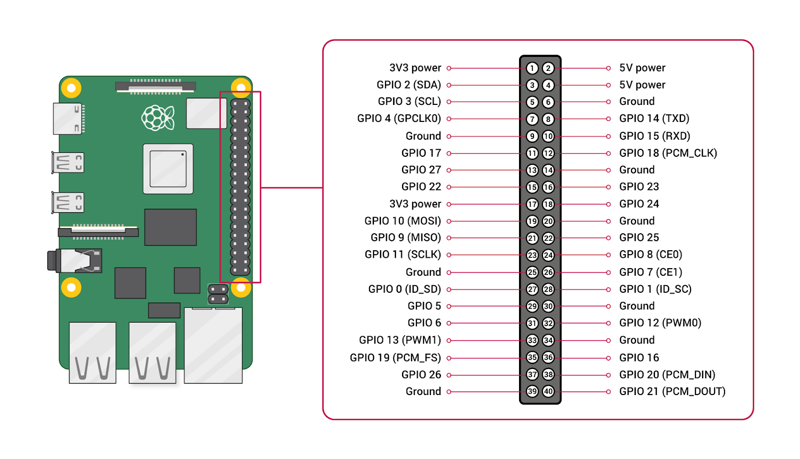

# Simtra Counter — Contador de Pasajeros

Aplicación para el conteo de pasajeros mediante sensores GPIO en una Raspberry Pi. Detecta ingresos y salidas según el orden de activación de los sensores y soporta dos modos de ejecución:

* **`app.py`** — servicio Flask con interfaz web y API REST en tiempo real.
* **`main.py`** — modo standalone (sin web) con alarma sonora vía buzzer cuando una persona se queda dentro de las barreras.

> Ambos modos comparten los mismos pines GPIO de los sensores. **No se debe ejecutar `simtra-counter` y `simtra-counter-main` al mismo tiempo**: solo uno de los dos servicios debe estar activo según el escenario de despliegue.

---

## Requisitos

* Raspberry Pi (cualquier modelo con GPIO)
* Python 3.9+
* 4 sensores conectados a los pines GPIO: **21 (S1)**, **20 (S2)**, **16 (S3)**, **12 (S4)**
* **Buzzer activo en GPIO 26** (requerido solo para el modo `main.py`)
* Acceso SSH o consola como usuario `admin`

---

## Pruebas

### 1. Ejecución rápida — modo Flask (`app.py`)

```bash
source /home/admin/env/bin/activate
cd /home/admin/simtra-counter
python app.py --host 0.0.0.0 --port 4000
```

> Este comando ejecuta la aplicación en modo desarrollo.

### 2. Ejecución rápida — modo standalone (`main.py`)

```bash
source /home/admin/env/bin/activate
cd /home/admin/simtra-counter
python main.py
```

> Modo standalone con buzzer. Salir con `Ctrl+C` (cierre limpio de GPIO).

---

## Instalación

### 1. Clonar el repositorio

```bash
cd /home/admin
git clone https://github.com/ctucl-loja/simtra-counter.git
cd simtra-counter
```

### 2. Crear y activar el entorno virtual

```bash
python3 -m venv /home/admin/env
source /home/admin/env/bin/activate
```

### 3. Instalar dependencias

```bash
pip install flask gpiozero
```

> En PC/Mac (sin GPIO) la aplicación Flask arranca automáticamente en **modo simulación**; no se requiere hardware adicional. El modo `main.py` sí requiere hardware real (sensores y buzzer).

---

## Configurar los servicios systemd

### Servicio Flask — `simtra-counter`

#### 1. Crear el archivo de servicio

```bash
sudo nano /etc/systemd/system/simtra-counter.service
```

Pegar el siguiente contenido:

```ini
[Unit]
Description=Aplicación de Conteo de Pasajeros (Flask)
After=network.target

[Service]
User=admin
WorkingDirectory=/home/admin/simtra-counter/
ExecStart=/home/admin/env/bin/python3 app.py --host 0.0.0.0 --port 4000
Restart=always
RestartSec=5
StandardOutput=journal
StandardError=journal

[Install]
WantedBy=multi-user.target
```

> Para entornos de producción se recomienda usar Gunicorn en lugar del servidor de desarrollo de Flask.

Guardar con `Ctrl+O`, luego `Ctrl+X`.

#### 2. Habilitar e iniciar el servicio

```bash
sudo systemctl daemon-reload
sudo systemctl enable simtra-counter
sudo systemctl start simtra-counter
```

#### 3. Verificar el estado

```bash
sudo systemctl status simtra-counter
```

La aplicación queda disponible en:

```
http://<ip-raspberry>:4000
```

---

### Servicio standalone — `simtra-counter-main`

#### 1. Crear el archivo de servicio

```bash
sudo nano /etc/systemd/system/simtra-counter-main.service
```

Pegar el siguiente contenido:

```ini
[Unit]
Description=Contador de Pasajeros (standalone con buzzer)
After=multi-user.target
Conflicts=simtra-counter.service

[Service]
User=admin
WorkingDirectory=/home/admin/simtra-counter/
ExecStart=/home/admin/env/bin/python3 main.py
Restart=always
RestartSec=5
KillSignal=SIGINT
TimeoutStopSec=10
StandardOutput=journal
StandardError=journal

[Install]
WantedBy=multi-user.target
```

> `KillSignal=SIGINT` permite que el script intercepte `Ctrl+C` (vía `KeyboardInterrupt`) y ejecute el bloque `finally` para apagar el buzzer y liberar los GPIO antes de detenerse.
>
> `Conflicts=simtra-counter.service` impide arrancar este servicio si el servicio Flask ya está activo (y viceversa si se agrega la directiva inversa al archivo `simtra-counter.service`).

Guardar con `Ctrl+O`, luego `Ctrl+X`.

#### 2. Habilitar e iniciar el servicio

```bash
sudo systemctl daemon-reload
sudo systemctl enable simtra-counter-main
sudo systemctl start simtra-counter-main
```

> Si el servicio Flask estaba activo, primero detenerlo: `sudo systemctl stop simtra-counter`.

#### 3. Verificar el estado

```bash
sudo systemctl status simtra-counter-main
```

Los eventos (`[INGRESO]`, `[SALIDA]`) y la alarma de permanencia se registran en el journal del sistema.

---

## Comandos útiles

| Acción                   | Servicio Flask                          | Servicio standalone                          |
| ------------------------ | --------------------------------------- | -------------------------------------------- |
| Ver logs en tiempo real  | `sudo journalctl -u simtra-counter -f`  | `sudo journalctl -u simtra-counter-main -f`  |
| Reiniciar el servicio    | `sudo systemctl restart simtra-counter` | `sudo systemctl restart simtra-counter-main` |
| Detener el servicio      | `sudo systemctl stop simtra-counter`    | `sudo systemctl stop simtra-counter-main`    |
| Deshabilitar el servicio | `sudo systemctl disable simtra-counter` | `sudo systemctl disable simtra-counter-main` |

---

## Conexión de hardware

| Componente | Pin GPIO (BCM) | Función               |
| ---------- | -------------- | --------------------- |
| S4         | 12             | Sensor — Ingreso      |
| S3         | 16             | Sensor — Ingreso      |
| S2         | 20             | Sensor — Salida       |
| S1         | 21             | Sensor — Ingreso      |
| Buzzer     | 26             | Alerta sonora (HIGH)  |

Los sensores se configuran con `pull_up=True`. El buzzer se controla mediante la clase `gpiozero.Buzzer` (activo en HIGH).

Se considera un **ingreso** cuando **S1 se activa antes que S2**, y una **salida** cuando ocurre lo contrario.
El evento requiere al menos **3 sensores activos simultáneamente** para ser válido.

### Comportamiento del buzzer (modo `main.py`)

* Suena un pitido corto (~0.2 s) al confirmar un **ingreso**.
* Si una persona permanece más de **1.5 s** dentro de las barreras, el buzzer emite pitidos consecutivos (~0.1 s cada 0.4 s) hasta que la persona se retire.

---

## API (solo modo Flask)

| Endpoint     | Método | Descripción                 |
| ------------ | ------ | --------------------------- |
| `/`          | GET    | Interfaz web principal      |
| `/api/state` | GET    | Estado actual en JSON       |
| `/api/reset` | POST   | Reinicia los contadores a 0 |

### Ejemplo de respuesta `/api/state`

```json
{
  "sensors": {"S1": false, "S2": false, "S3": false, "S4": false},
  "entry_counter": 12,
  "exit_counter": 8
}
```

---

## Diagrama de GPIO



---

## Autor

Proyecto desarrollado para sistemas de conteo en buses del transporte urbano.
Principal Author: Ing. Joan David Diaz